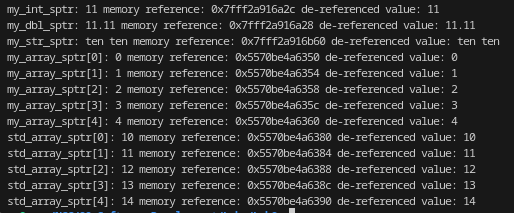

# Lab #8 - Passing Data and using Pointers
This lab demonstrates the use of variables, reference variables, and pointer variables in C++.

## Prerequsites
- Make (GNU Make)
> This should be installed by deafult in Linux. Verify using ```make -v```. This should give some output showing its version.

## Usage:
```
mkdir lab8
cd lab8
git clone -b lab8 https://github.com/ompiepy/ncccsce306.git .
make
```
## Output


