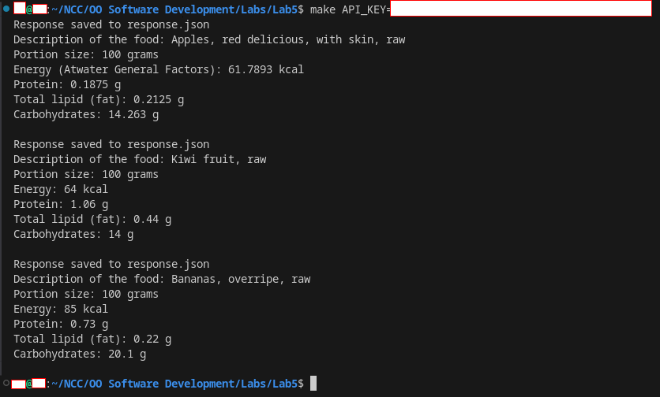
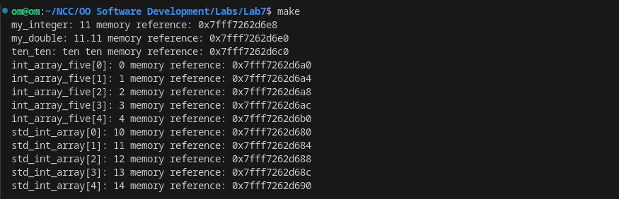
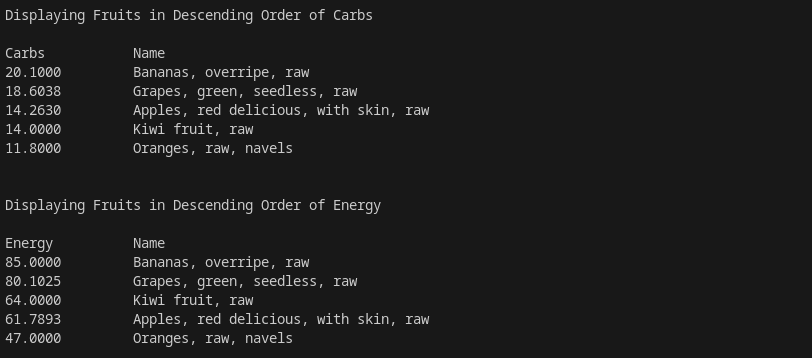
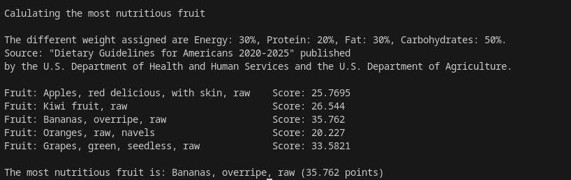

# Lab 6: Analyzing Nutritional Values of "Fruit" Objects
This file analyzes some nutritional values obtained from [Lab5]([)https://github.com/ompiepy/ncccsce306/tree/lab5).

## Prerequsites
- libcurl
```
# To install in Linux
sudo apt-get install libcurl4-nss-dev
```
- Make (GNU Make)
> This should be installed by deafult in Linux. Verify using ```make -v```. This should give some output showing its version.

## Usage:
```
mkdir lab6
cd lab6
git clone -b lab6 https://github.com/ompiepy/ncccsce306.git .
make API_KEY="YOUR_API_KEY"
```
> Remember to replace YOUR_API_KEY with your API Key. You can get one from [here](https://www.ers.usda.gov/developer/data-apis/#apiForm).

## Output




